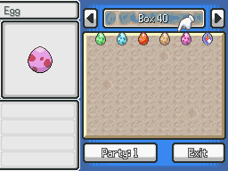

# Change Egg Picture
This script is for Pokémon Essentials. It changes the egg picture for each pokémon that they contains, one for each Egg Group,

## Screens

## Compatibility
Doesn't work on Essentials versions v19 and above.

## Installation
Follow the [Script](/Script.rb) instructions.